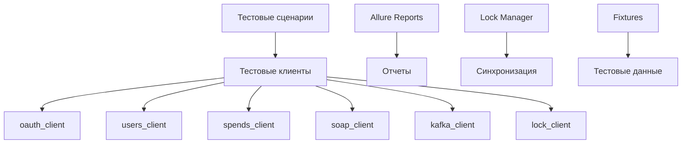

# 🧪 Niffler Python Tests

<div align="center">


<br>


</div>

> **Комплексная система автоматизированного тестирования для проекта Niffler**  
> Покрывает UI, REST API, SOAP, Kafka, gRPC и базы данных

---

## 📋 Содержание

- [🚀 Быстрый старт](#-быстрый-старт)
- [🏗️ Архитектура](#️-архитектура)
- [🧩 Типы тестов](#-типы-тестов)
- [⚙️ Настройка окружения](#️-настройка-окружения)
- [🎯 Запуск тестов](#-запуск-тестов)
- [📊 Отчеты](#-отчеты)
- [🔧 Конфигурация](#-конфигурация)
- [📁 Структура проекта](#-структура-проекта)
- [📝 Логирование](#-логирование)

---

## 🚀 Быстрый старт

### Предварительные требования

- **Python 3.11+**
- **Java 21+** (для Allure)
- **Docker & Docker Compose**
- **Chrome/Chromium** (для UI тестов)

### Установка

```bash
# Клонирование репозитория
git clone -b dev git@github.com:illusionx11/niffler-py-st3.git
cd niffler-python-tests

# Создание виртуального окружения
python -m venv venv
source venv/bin/activate  # Linux/Mac
# или
venv\Scripts\activate     # Windows

# Установка зависимостей
pip install -r requirements.txt

# Запуск инфраструктуры
bash docker-compose-dev.sh

# Запуск тестов
pytest -n 4 --dist=worksteal
```

---

## 🏗️ Архитектура

### Компоненты системы



### Ключевые особенности

- **🔄 Параллельное выполнение** - несколько воркеров одновременно
- **🔒 Система блокировок** - предотвращение конфликтов между тестами
- **📊 Детальная отчетность** - Allure с историей тестов
- **🎯 Изоляция тестов** - независимые тестовые данные
- **⚡ Быстрая обратная связь** - CI/CD интеграция

---

## 🧩 Типы тестов

### 🎨 UI Тесты (Selenium)
```python
@pytest.mark.ui
class TestSpendingsUI:
    def test_add_spending(self, driver):
        """Тест добавления расхода через UI"""
        # Автоматизация браузера
```

**Особенности:**
- Selenium WebDriver
- Page Object Model
- Скриншоты при ошибках
- Параллельное выполнение

### 🌐 REST API Тесты
```python
@pytest.mark.rest_api
class TestAuthAPI:
    def test_user_registration(self, auth_client):
        """Тест регистрации пользователя"""
        # HTTP запросы и валидация
```

**Особенности:**
- HTTP клиенты
- JSON валидация
- Статус коды
- Авторизация

### 📡 SOAP API Тесты
```python
@pytest.mark.soap
class TestSoapUserData:
    def test_get_user_info(self, soap_client):
        """Тест получения данных пользователя через SOAP"""
        # XML запросы и парсинг
```

**Особенности:**
- XML запросы
- SOAP envelope
- WSDL интеграция
- Пагинация

### 📨 Kafka Тесты
```python
@pytest.mark.kafka
class TestAuthRegistrationKafka:
    def test_message_produced(self, kafka_client):
        """Тест отправки сообщений в Kafka"""
        # Producer/Consumer тестирование
```

**Особенности:**
- Producer/Consumer
- Топики и партиции
- Offset management
- Асинхронная обработка

### 🔌 gRPC Тесты
```python
@pytest.mark.grpc
class TestCurrencyService:
    def test_currency_conversion(self, grpc_client):
        """Тест конвертации валют через gRPC"""
        # Protocol Buffers
```

**Особенности:**
- Protocol Buffers
- Streaming
- Interceptors
- Метрики

### 🗄️ Тесты для Базы данных
```python
@pytest.mark.database
class TestCategoriesDB:
    def test_category_creation(self, categories_db):
        """Тест создания категории в БД"""
        # Прямые SQL запросы к PostgreSQL
```

**Особенности:**
- PostgreSQL
- Прямые SQL запросы
- Транзакции и изоляция
- Очистка тестовых данных
- Тестирование категорий и расходов

---

## ⚙️ Настройка окружения

### Переменные окружения

В проекте есть примеры конфигурационных файлов:
- `client.env.sample` - для клиентских настроек
- `server.env.sample` - для серверных настроек

**Настройка:**

1. Скопируйте примеры в рабочие файлы:
```bash
cp client.env.sample client.env
cp server.env.sample server.env
```

2. Заполните значения после знака "=" в файлах:

```env
# client.env
TEST_USERNAME=
TEST_PASSWORD=

# server.env
AUTH_URL=
GATEWAY_URL=
FRONTEND_URL=
SPENDS_DB_URL=
USERDATA_DB_URL=
AUTH_DB_URL=
KAFKA_ADDRESS=
CURRENCY_SERVICE_HOST=
WIREMOCK_HOST=
```

### Docker Compose

```bash
# Запуск всей инфраструктуры
bash docker-compose-dev.sh
```

---

## 🎯 Запуск тестов

### Базовые команды

```bash
# Все тесты
pytest

# Параллельное выполнение
pytest -n 4 --dist=worksteal

# С маркировкой
pytest -m "ui"
pytest -m "api"
pytest -m "soap"
pytest -m "kafka"
pytest -m "grpc"
pytest -m "database"
pytest -m "registration"

# Конкретный тест
pytest tests/ui/test_spendings.py::TestSpendings::test_add_spending

# С подробным выводом
pytest -v -s
```

### Параллельное выполнение

```bash
# 4 воркера с распределением нагрузки
pytest -n 4 --dist=worksteal

# Группировка тестов
pytest -n 4 --dist=loadgroup

# Конкретные группы
pytest -m "xdist_group(01_users)"
pytest -m "xdist_group(02_category)"
```

### Фильтрация тестов

```bash
# По маркировке
pytest -m "not slow"
pytest -m "ui and not flaky"

# По имени
pytest -k "test_user"
pytest -k "not test_admin"

# По файлу
pytest tests/api/
pytest tests/ui/test_spendings.py
```

---

## 📊 Отчеты

### Allure Reports

```bash
# Генерация отчета
allure serve allure-results/

# Создание статического отчета
allure generate allure-results/ -o allure-report/

# Открытие отчета
allure open allure-report/
```

### Структура отчета

- **📈 Дашборд** - общая статистика
- **📋 Тест-планы** - структурированные сценарии
- **🔍 Детали тестов** - шаги, скриншоты, логи
- **📊 Графики** - тренды и метрики
- **🐛 Дефекты** - связанные баги

### Интеграция с CI/CD

```yaml
# GitHub Actions
- name: Generate Allure Report
  uses: simple-elf/allure-report-action@v1
  with:
    allure_results: allure-results
    allure_report: allure-report

- name: Deploy to GitHub Pages
  uses: peaceiris/actions-gh-pages@v3
  with:
    publish_dir: allure-report
```

---

## 🔧 Конфигурация

### pytest.ini

```ini
[pytest]
addopts = 
    --alluredir allure-results
    --clean-alluredir
    --headless
    -s
    -v
python_files = tests.py test_*.py *_tests.py
testpaths = tests
markers =
    registration: registration tests
    login: login tests
    main_page: mainpage tests
    spendings: spendings tests
    profile: profile tests
    categories: profile categories tests
    profile_data: profile data tests
    currencies: currencies tests
    api: api tests
    kafka: kafka tests
    grpc: grpc tests
    soap: soap tests
    ui: ui tests
    database: database tests
    user_management: user management tests
    friends_management: friends management tests
```

### conftest.py

```python
# Плагины pytest
pytest_plugins = [
    "fixtures.auth_fixtures", 
    "fixtures.client_fixtures",
    "fixtures.lock_fixtures",
    "fixtures.user_fixtures",
    "fixtures.pages_fixtures",
    "fixtures.profile_fixtures",
    "fixtures.spendings_fixtures",
    "fixtures.soap_fixtures"
]

# Кастомный логгер с UTF-8 поддержкой
class UTF8FileHandler(logging.FileHandler):
    def __init__(self, *args, **kwargs):
        super().__init__(*args, encoding="utf-8", **kwargs)

# Настройка логирования в файл
def pytest_configure():
    folder = Path(__file__).resolve().parent
    with open(f"{folder}/logs/logs.txt", "w", encoding="utf-8"):
        pass
    
    logger = logging.getLogger()
    logger.setLevel(logging.INFO)
    logger.handlers.clear()
    
    file_handler = UTF8FileHandler(f"{folder}/logs/logs.txt")
    file_handler.setLevel(logging.INFO)
    formatter = logging.Formatter('%(asctime)s - %(levelname)s - %(message)s')
    file_handler.setFormatter(formatter)
    logger.addHandler(file_handler)
```

---

## 📁 Структура проекта

```
niffler-python-tests/
├── 📁 tests/                    # Тестовые сценарии
│   ├── 📁 ui/                  # UI тесты
│   ├── 📁 rest_api/            # REST API тесты
│   ├── 📁 soap/                # SOAP API тесты
│   ├── 📁 kafka/               # Kafka тесты
│   ├── 📁 grpc/                # gRPC тесты
│   └── 📁 database/            # База данных
├── 📁 clients/                 # API клиенты
│   ├── auth_client.py
│   ├── soap_client.py
│   ├── kafka_client.py
│   └── grpc_client.py
├── 📁 models/                  # Модели данных
│   ├── user.py
│   ├── spending.py
│   └── enums.py
├── 📁 fixtures/                # Фикстуры
│   ├── auth_fixtures.py
│   ├── soap_fixtures.py
│   └── lock_fixtures.py
├── 📁 utils/                   # Утилиты
│   ├── user_creator.py
│   ├── cleaner.py
│   └── allure_helpers.py
├── 📁 databases/               # Работа с БД
│   ├── auth_db.py
│   ├── userdata_db.py
│   └── spends_db.py
├── 📁 pages/                   # Page Objects
│   ├── base_page.py
│   ├── login_page.py
│   └── spendings_page.py
├── 📁 allure-results/          # Результаты Allure
├── 📁 allure-report/           # Отчеты Allure
├── 📁 logs/                    # Логи тестов (logs.txt)
├── 📁 lock/                    # Файлы блокировок
├── requirements.txt            # Зависимости Python
├── pytest.ini                 # Конфигурация pytest
├── conftest.py                # Глобальные фикстуры
└── README.md                  # Документация
```

---

## 📝 Логирование

### Кастомный логгер

Проект использует кастомный логгер с UTF-8 поддержкой для записи всех событий в файл `logs/logs.txt`.

```python
class UTF8FileHandler(logging.FileHandler):
    def __init__(self, *args, **kwargs):
        super().__init__(*args, encoding="utf-8", **kwargs)
```

### Настройка логирования

```python
def pytest_configure():
    folder = Path(__file__).resolve().parent
    with open(f"{folder}/logs/logs.txt", "w", encoding="utf-8"):
        pass
    
    logger = logging.getLogger()
    logger.setLevel(logging.INFO)
    logger.handlers.clear()
    
    file_handler = UTF8FileHandler(f"{folder}/logs/logs.txt")
    file_handler.setLevel(logging.INFO)
    formatter = logging.Formatter('%(asctime)s - %(levelname)s - %(message)s')
    file_handler.setFormatter(formatter)
    logger.addHandler(file_handler)
```

### Использование в тестах

```python
import logging

def test_example():
    logging.info("Начало выполнения теста")
    # Ваш тест
    logging.info("Тест завершен успешно")
```

### Просмотр логов

```bash
# Просмотр логов в реальном времени
tail -f logs/logs.txt

# Поиск ошибок
grep "ERROR" logs/logs.txt

# Поиск по конкретному тесту
grep "test_user_registration" logs/logs.txt
```

---

## 📞 Поддержка

### Полезные ссылки

- [📚 Документация pytest](https://docs.pytest.org/)
- [🎨 Allure Framework](https://docs.qameta.io/allure/)
- [🐳 Docker Compose](https://docs.docker.com/compose/)
- [🔧 GitHub Actions](https://docs.github.com/en/actions)

---

## 📄 Лицензия

Этот проект распространяется под лицензией MIT. См. файл [LICENSE](LICENSE) для получения дополнительной информации.

---

<div align="center">

**Автор: Заламаев Илья**

<a href="https://t.me/zalamaev"></a>
<a href="https://vk.com/za1amaev"></a>

</div>
